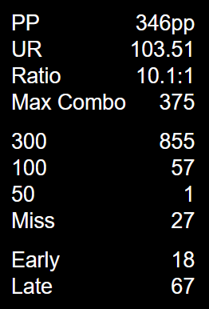
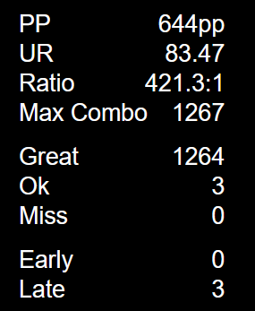
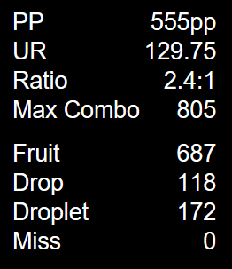
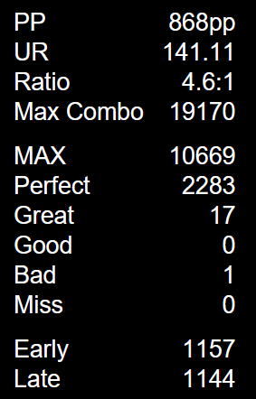

<div align="center">

# Hit Count

**A real-time hit count overlay for osu! powered by [tosu](https://github.com/KotRikD/tosu)**


Displays **PP · UR · Ratio · Hit Counts · Early/Late** for every osu! game mode in a clean, minimal overlay.  
Works as an in-game overlay or OBS browser source.  
Inspired by **[2ky](https://github.com/2222zz/osu-custom-overlay)**'s mania hit count overlay.

<br>

| osu! standard | Taiko | Catch the Beat | Mania |
|:---:|:---:|:---:|:---:|
|  |  |  |  |

</div>

---

## Features

- **All four game modes** — osu! standard, Taiko, Catch the Beat, and Mania with correct hit labels per mode
- **Per-judgement Early/Late** — distributes early/late counts proportionally across each hit tier using precise hit error data
- **Live UR calculation** — computes Unstable Rate directly from the hit error array every frame
- **Ratio display** — shows good-hit to bad-hit ratio, adapts formula per mode (handles ∞:1 edge cases)
- **Mode-aware labels** — 300/100/50 for standard, Great/Ok for Taiko, Fruit/Drop/Droplet for Catch, MAX/Perfect/Great/Good/Bad for Mania
- **Toggleable sections** — hide PP, UR, Ratio, Hit Counts, Early/Late, or show Max Combo via settings
- **Auto-resets** — counters reset cleanly on retry, map change, or returning to menu
- **osu! Lazer support** — handles floating-point hit errors and object-shaped OD/mods data automatically

---

## Installation

1. **Download** this repository as a ZIP (or `git clone` it)
2. **Place** the folder inside your tosu `/static` directory
3. **Open** tosu and navigate to the overlay in your browser or OBS
4. **Configure** settings to your preference (see below)
5. **Add** the overlay URL as a Browser Source in OBS, or use it as an in-game overlay

> **Tip:** Set the browser source to **240×430** with a transparent background for best results.

---

## Settings

<details>
<summary><b>Stats Display</b></summary>

| Setting | Default | Description |
|---|---|---|
| Hide PP | `false` | Hides the PP display |
| Hide UR | `false` | Hides the Unstable Rate display |
| Hide Ratio | `false` | Hides the hit ratio display |
| Show Max Combo | `false` | Displays the current max combo |

</details>

<details>
<summary><b>Hit Counts</b></summary>

| Setting | Default | Description |
|---|---|---|
| Hide Hit Counts | `false` | Hides 300g, 300, 200, 100, 50, and Miss counts |
| Hide Early/Late | `false` | Hides the early and late hit counts |

</details>

---

## How It Works

tosu streams live game data over WebSocket. The overlay subscribes to two endpoints simultaneously:

- **`/websocket/v2`** — hit counts, PP, mode, OD, mods, combo
- **`/websocket/v2/precise`** — raw `hitErrors` array for UR and per-judgement Early/Late

### Early/Late Calculation

Each new hit error is classified by its absolute millisecond value against the timing windows for the current mode and OD. Negative values are **Early**, positive values are **Late**. These tallies are then distributed proportionally across displayed hit rows using a delta-tracking system, so the on-screen Early/Late counts always sum correctly even when the hit error data arrives faster than display updates.

> EZ halves OD · HR multiplies OD by 1.4 (capped at 10) before formulas are applied.

### Ratio Formula

| Mode | Formula |
|---|---|
| osu! standard | `300 / (100 + 50 + Miss)` |
| Taiko | `Great / (Ok + Miss)` |
| Catch | `Fruit / (Drop + Droplet + Miss)` |
| Mania | `MAX / (Perfect + Great + Good + Bad + Miss)` |

---

## File Structure

```
minimal-hit-count/
 index.html        # Overlay HTML
 main.css          # Styles & layout
 main.js           # WebSocket logic, UR, Early/Late, hit counts
 settings.json     # Plugin settings (read by tosu)
 metadata.txt      # Plugin metadata
```

---

## Compatibility

| | |
|---|---|
| **Overlay tool** | [tosu](https://github.com/KotRikD/tosu) (WebSocket v2 + v2/precise) |
| **Game modes** | osu! standard · Taiko · Catch the Beat · Mania |
| **Client** | Stable · Lazer |
| **Mods** | EZ · HR · DT / HT (rate-aware) |
| **OBS** | Browser Source, 240×430, transparent |

---

## Credits

- **Author** — [Albert](https://github.com/AlberttFrgk/)
- **Inspired by** — [2ky](https://github.com/2222zz/osu-custom-overlay)'s mania hit count overlay
- **Powered by** — [tosu](https://github.com/KotRikD/tosu) by KotRikD
